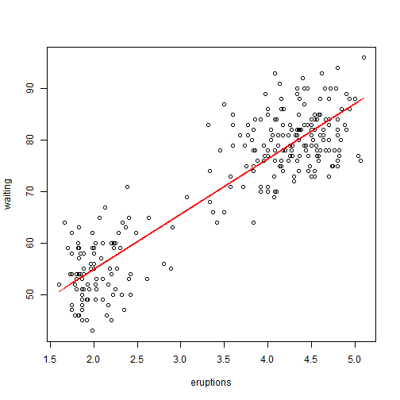

Developing Data Products 
========================================================
author: A. Kramer
date: 02/23/16
transition: rotate
transition-speed: slow

<small>
Final Project for the Developint Data Products 
class offered by Coursera
</small>

Project Background
========================================================
The final project's requirements are to create a Shiny application 
and to use Slidfy or RStudio Presnter to build a presentation. The basic
requirements are outlined in the final project description for the class. 
This project utilizes **faithful** data set available in R to build a linear
model of the eruption duration vs. waiting time. The Shiny user interface
allows to input the waiting time in minute and the outputs predicted duration 
of the eruption following the wait. The links to the **GitHub repo**, 
**RStudio Presentation**, and a **Shiny application** are located at the 
last slide of this presentation.

Data Used
========================================================
There is a **faithful** data set available in R. This data set 
consists of two dimensions related to **Old Faithful Geyser**: 
waiting and eruptions. **waiting** dimension signifies the waiting 
time between eruptions, while **eruption** dimension signifies 
the length of the eruptions. Table below provides the 
summary of the data set.

```r
summary(faithful)
```

```
   eruptions        waiting    
 Min.   :1.600   Min.   :43.0  
 1st Qu.:2.163   1st Qu.:58.0  
 Median :4.000   Median :76.0  
 Mean   :3.488   Mean   :70.9  
 3rd Qu.:4.454   3rd Qu.:82.0  
 Max.   :5.100   Max.   :96.0  
```

Wait Time vs. Eruption Duration
========================================================
There clearly exists a linear relationship between the waiting 
time and the duration of the eruption itself based on the plot of 
the **faithful** data set presented below.



Links
========================================================
To run the Shiny application, click on the link to the **Shiny application** 
found in the list below. The Shiny application should open in the **browser window**
presenting short write up and a slider.  By **moving the slider**, new predictions are
displayed **just below the write up** on the app window as the slider is moved.
- [GitHub Repo]()
- [Shiny Application]()
- [This Presentation]()
